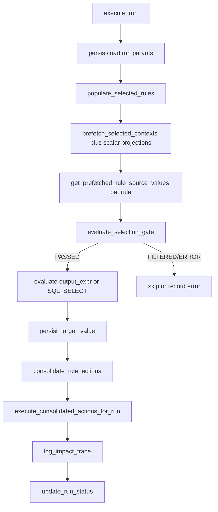
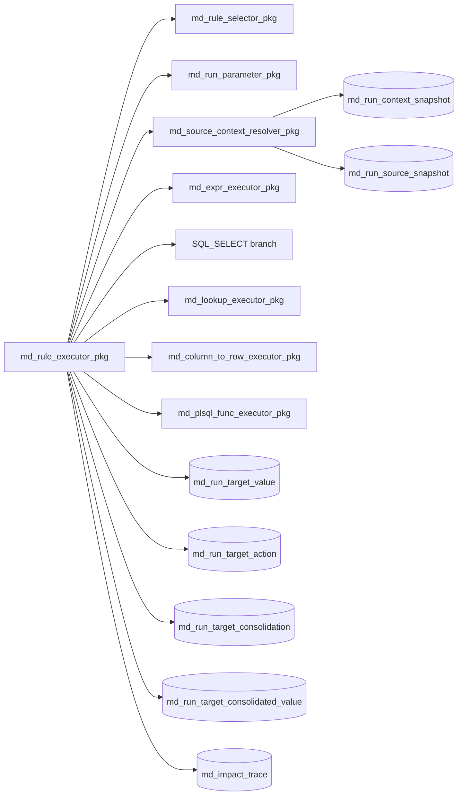

# System Architecture

## Current Behavior

### System Intent
- The engine resolves metadata-defined rules for a run and computes/persists target outcomes per selected change event.
- Rule execution is orchestrated by a central package that performs rule selection, context resolution, gate evaluation, output expression or SQL_SELECT evaluation, per-rule audit persistence, target consolidation, consolidated target execution, and trace logging.
- Source-context prefetch now supports rule-scoped scalar projection expressions (metadata-driven) and merges them into the same resolved JSON as md_rule_input column projections.
- Target conflict resolution is deterministic: nvl(md_rule.rule_priority_no, 0) desc, then rule_id desc.

### Boundaries
- In scope: metadata-driven selection, expression execution, lookup/PLSQL/column-to-row execution, source-context resolution, scalar projection expression enrichment, target DML orchestration, runtime diagnostics.
- In scope: metadata-driven selection, expression execution, SQL_SELECT execution, lookup/PLSQL/column-to-row execution, source-context resolution, scalar projection expression enrichment, target DML orchestration, runtime diagnostics.
- Out of scope in these packages: ingestion into md_change_event_raw, orchestration outside execute_run caller contract, deployment/promotion automation.

### Invariants Observed In Code
- Run status finalization is always attempted at end of execute_run via update_run_status.
- Selected rules are persisted before execution (populate_selected_rules called before per-rule loop).
- Gate evaluation updates md_run_selected_rule.gate_eval_* fields before deciding pass/filter/error.
- Target value persistence has idempotency check via value_fingerprint.

### Non-Goals (From Available Code)
- No explicit COMMIT/ROLLBACK control in analyzed package bodies.
- No explicit queue/stream consumption in analyzed package set.

## End-to-End Sequence

## Component Interaction

## Package Call Graph (Observed)
- md_rule_executor_pkg.execute_run
  - md_run_parameter_pkg.persist_run_parameters or load_run_parameters
  - md_rule_selector_pkg.populate_selected_rules
  - md_source_context_resolver_pkg.prefetch_selected_contexts
  - md_source_context_resolver_pkg.get_prefetched_rule_source_values
    - md_source_context_resolver_pkg.build_context_projection_json (md_rule_input + md_rule_input_expr)
  - md_rule_executor_pkg.evaluate_selection_gate
    - md_rule_executor_pkg.substitute_change_delta_tokens
    - md_rule_executor_pkg.substitute_tokens
  - md_expr_executor_pkg.evaluate_expr (for output_expr path)
  - md_rule_executor_pkg.execute_sql_select_to_json (for SQL_SELECT path)
  - md_rule_executor_pkg.persist_target_value
  - md_rule_executor_pkg.consolidate_rule_actions
    - md_rule_executor_pkg.upsert_target_consolidation
    - md_rule_executor_pkg.upsert_consolidated_winner
  - md_rule_executor_pkg.execute_consolidated_actions_for_run
  - md_rule_executor_pkg.log_impact_trace
  - md_rule_executor_pkg.update_run_status

## Suggested Improvements
- Add a consolidated-value provenance table for optional loser candidate audits without changing winners-only runtime storage.
- Add dedicated performance smoke for high rule fan-in into one target entity.
- Add package-level transaction policy statement (currently implicit).

## Evidence References
- plsql/packages/md_rule_executor_pkg.pkb :: execute_run, evaluate_selection_gate, persist_target_value, consolidate_rule_actions, execute_consolidated_actions_for_run, log_impact_trace, update_run_status
- plsql/packages/md_rule_executor_pkg.pks :: run_result_rec, run_metrics_rec, computed_value_rec
- plsql/packages/md_rule_selector_pkg.pkb :: populate_selected_rules
- plsql/packages/md_run_parameter_pkg.pkb :: persist_run_parameters, load_run_parameters, validate_required_parameters
- plsql/packages/md_source_context_resolver_pkg.pkb :: prefetch_selected_contexts, get_prefetched_rule_source_values, resolve_rule_source_values
- sql/scripts/033_md_rule_input_expr_upgrade.sql :: md_rule_input_expr incremental deployment
- sql/scripts/034_md_rule_priority_upgrade.sql :: md_rule.rule_priority_no optional precedence metadata
- sql/scripts/035_md_target_consolidation_runtime_upgrade.sql :: consolidated runtime artifacts and action trace phase columns
- sql/scripts/036_md_sql_select_rule_upgrade.sql :: md_rule.rule_type SQL_SELECT support and payload contract comment
- plsql/packages/md_expr_executor_pkg.pkb :: evaluate_expr
- plsql/packages/md_lookup_executor_pkg.pkb :: execute_lookup
- plsql/packages/md_column_to_row_executor_pkg.pkb :: execute_column_to_row
- plsql/packages/md_plsql_func_executor_pkg.pkb :: execute_plsql_func
- sql/scripts/020_md_runtime.sql :: md_run, md_run_selected_rule, md_run_target_value, md_run_target_action, md_impact_trace
- sql/scripts/073_md_target_consolidation_smoke.sql :: deterministic consolidation + consolidated-only execution validation
- sql/scripts/074_md_sql_select_rule_smoke.sql :: SQL_SELECT guardrails, cardinality checks, alias-derived outputs, and consolidated execution validation
